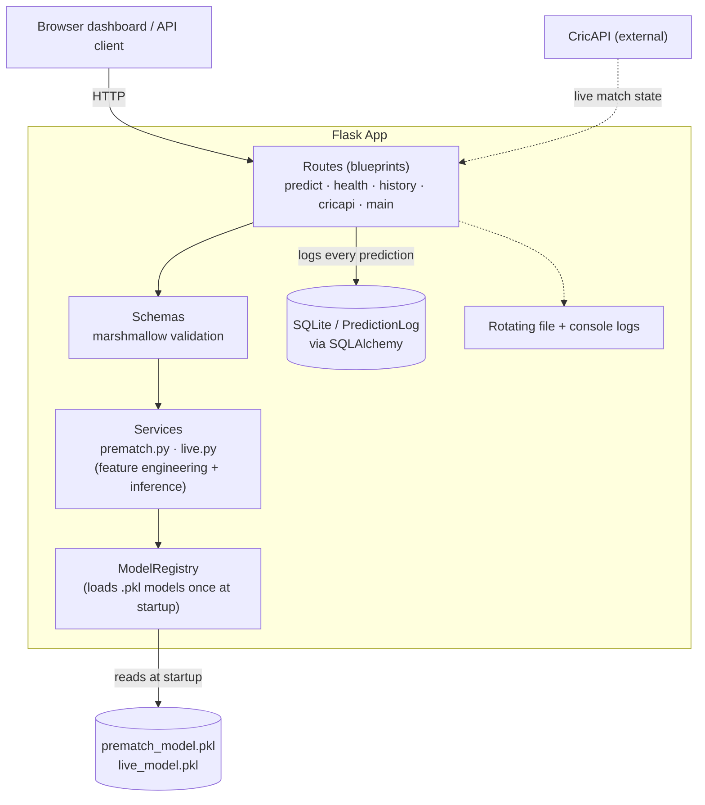

# Live Cricket Win-Probability System (WPL)

A ball-by-ball win-probability model for T20 cricket, served through a Flask API. Two models cover the two phases of a match: a pre-match model that estimates win probability before a ball is bowled, and a live model that updates it continuously as the match progresses.


## Overview

Predicting match outcomes from a fixed pre-match snapshot is a different problem from predicting them mid-innings, where run rate, wickets in hand, and required rate shift the picture ball by ball. This project treats the two as separate modelling problems with separate pipelines, so training and real-time inference stay consistent with each other, and evaluates both on probability quality (log-loss, calibration) rather than raw classification accuracy — a model that is right 70% of the time but always says "90%" is worse than one that says "55%" honestly.

The serving layer is built as a proper Flask application factory with a layered architecture (routes → services → models), a database that logs every prediction for auditability, structured logging, environment-driven configuration, and a validated API surface — rather than a single script.

## Architecture



**Request flow:** a client hits a route → the payload is validated against a marshmallow schema (bad input never reaches the model) → the relevant service engineers features and calls the trained model → the route logs the request/response/latency to SQLite → the response is returned. Errors raised anywhere in that chain are caught centrally and returned as consistent JSON.

## Methodology

**Pre-match model**
- Logistic Regression, tuned via `GridSearchCV`
- Features: recent win-rate differential (5 and 10 matches), venue win-rate differential, head-to-head win-rate, venue experience, toss outcome, and toss choice
- Selected for interpretability and stability on a small, high-variance pre-match feature set

**Live model**
- Random Forest classifier, retrained on ball-by-ball match state
- Features: innings, cumulative runs/wickets, wickets and balls remaining, current and required run rate, run-rate differential, runs in the last 6 overs, and phase-of-innings flags (powerplay / middle overs / death overs)
- Derived features (run rate, required run rate, resources remaining) are computed live in the API from raw match state, so the client only needs to send basic scorecard values

## Results

| Model | Metric | Score |
|---|---|---|
| Pre-match (Logistic Regression) | Test accuracy | 73.8% |
| Pre-match (Logistic Regression) | Test AUC | 0.586 |
| Live (Random Forest) | Log-loss | 0.652 |

The pre-match model's modest AUC reflects a genuinely hard problem: T20 outcomes before a ball is bowled are close to a coin flip, and the model is deliberately not overfit to noise in a small pre-match feature set. The live model is evaluated on log-loss rather than accuracy, since a live win-probability tracker is judged on how well-calibrated its probabilities are as the match state evolves, not just whether it picks the eventual winner.

## Data & persistence

Every prediction served by `/api/prematch-predict` and `/api/live-predict` is logged to a `prediction_logs` table (SQLite by default, swappable for Postgres via `DATABASE_URL`) with the request payload, response, and latency. `/api/history` reads it back — this is what backs the "Recent predictions" panel on the dashboard, and gives a real audit trail rather than a stateless demo.

## Validation & error handling

Input is validated with marshmallow schemas (`app/schemas.py`) before it ever reaches a model — invalid types or out-of-range values (e.g. `cum_wickets: 15`) return a `400` with field-level detail instead of failing deep inside a prediction call. All errors funnel through a single set of handlers (`app/errors.py`) so the API always returns a consistent `{"success": false, "error": ...}` shape.

## API

| Endpoint | Method | Description |
|---|---|---|
| `/api/prematch-predict` | POST | Win probability from pre-match features |
| `/api/live-predict` | POST | Win probability from current match state |
| `/api/cricapi-live/<match_id>` | GET | Fetches a live match from CricAPI and returns a live prediction |
| `/api/history?limit=20` | GET | Recent logged predictions (from the database) |
| `/api/health` | GET | Model load status |

Example request to `/api/live-predict`:
```json
{
  "cum_runs": 142,
  "cum_wickets": 4,
  "balls_faced": 108,
  "target": 166
}
```

Example request to `/api/prematch-predict`:
```json
{
  "win_rate_diff": 0.10,
  "win_rate_diff_10": 0.05,
  "venue_win_rate_diff": 0.05,
  "h2h_win_rate_diff": 0.60,
  "venue_exp": 5,
  "toss_won_by_A": 1,
  "toss_choice": 1
}
```

A minimal dashboard at `/` lets you try both endpoints from the browser without writing any requests by hand.

## Repository structure

```
.
├── app/
│   ├── __init__.py             # application factory (config, DB, blueprints, model loading)
│   ├── config.py                # env-var driven config (Config / TestConfig)
│   ├── extensions.py            # SQLAlchemy instance
│   ├── models.py                 # PredictionLog DB model
│   ├── schemas.py                 # marshmallow request validation
│   ├── errors.py                   # custom exceptions + centralized JSON error handlers
│   ├── logging_config.py            # rotating file + console logging
│   ├── services/
│   │   ├── model_loader.py           # loads the two .pkl models once, at startup
│   │   ├── prematch.py                 # pre-match prediction logic
│   │   └── live.py                      # live prediction logic + feature engineering
│   └── routes/
│       ├── main.py                       # dashboard page
│       ├── predict.py                     # /api/prematch-predict, /api/live-predict
│       ├── health.py                       # /api/health
│       ├── history.py                       # /api/history
│       └── cricapi.py                        # /api/cricapi-live/<id>
├── templates/
│   └── index.html                # dashboard: prediction forms + live history table
├── tests/
│   ├── conftest.py                 # app/client fixtures (in-memory DB, real models)
│   └── test_app.py                  # 11 tests: validation, predictions, history, edge cases
├── .github/workflows/ci.yml    # runs the test suite on every push/PR
├── prematch_model.pkl
├── live_model.pkl
├── run.py                      # entrypoint
├── requirements.txt
├── requirements-dev.txt
├── Dockerfile
├── .env.example
└── README.md
```

## How to run

```bash
git clone https://github.com/Riks1/live-cricket-win-probability.git
cd live-cricket-win-probability
pip install -r requirements.txt

# optional: for the live CricAPI integration
cp .env.example .env   # then add your own CricAPI key

python run.py
```

The app runs at `http://localhost:5000`. Open it in a browser for the dashboard, or hit the endpoints directly.

### With Docker

```bash
docker build -t win-probability .
docker run -p 5000:5000 win-probability
```

## Testing

```bash
pip install -r requirements-dev.txt
pytest -v
```

Tests load the real pickled models and exercise the actual application factory (`create_app`) against an in-memory database — including validation failures, edge cases like zero overs bowled, and confirming predictions are correctly logged and retrievable via `/api/history` — rather than mocking predictions. CI runs this suite on every push via GitHub Actions.

## Tech stack

Python · Flask · scikit-learn · Pandas · NumPy · CricAPI

## Notes / limitations

- The pre-match model's low AUC is an honest reflection of how little signal exists before a match starts; it is intentionally not tuned past that ceiling.
- Live predictions depend on accurate real-time match state; the CricAPI integration is a convenience layer and not required to use the core `/api/live-predict` endpoint.
- Models were trained on historical Cricsheet data and have not been validated on live in-season data yet — treat outputs as directional, not authoritative.

## License

MIT — see [LICENSE](LICENSE).
